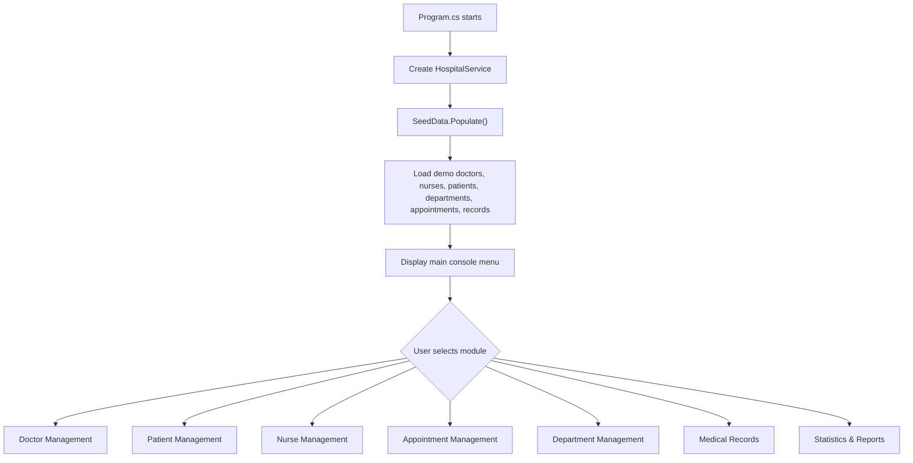
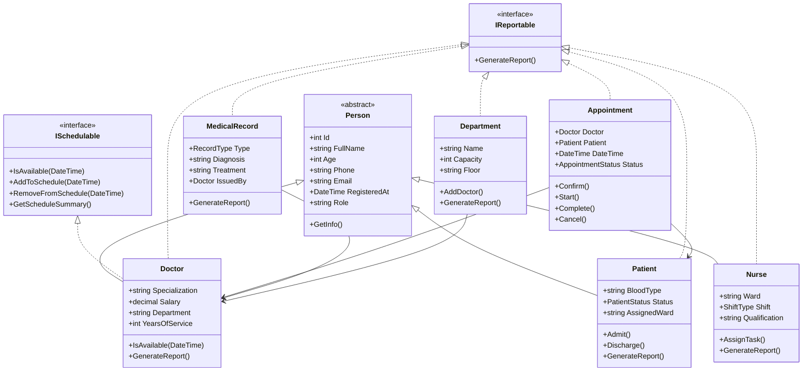
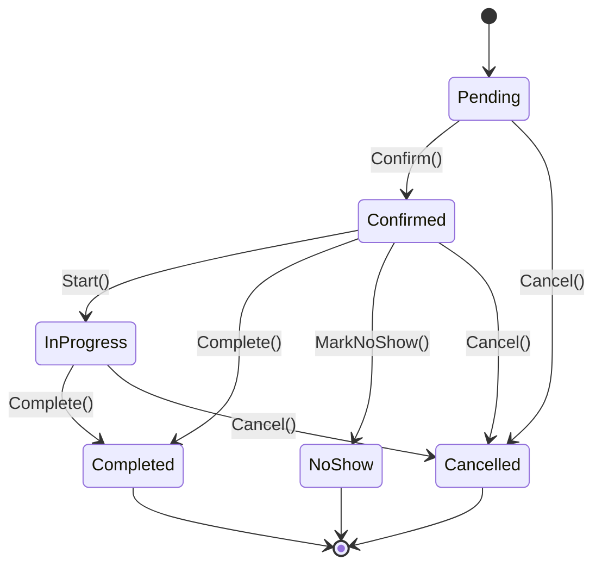
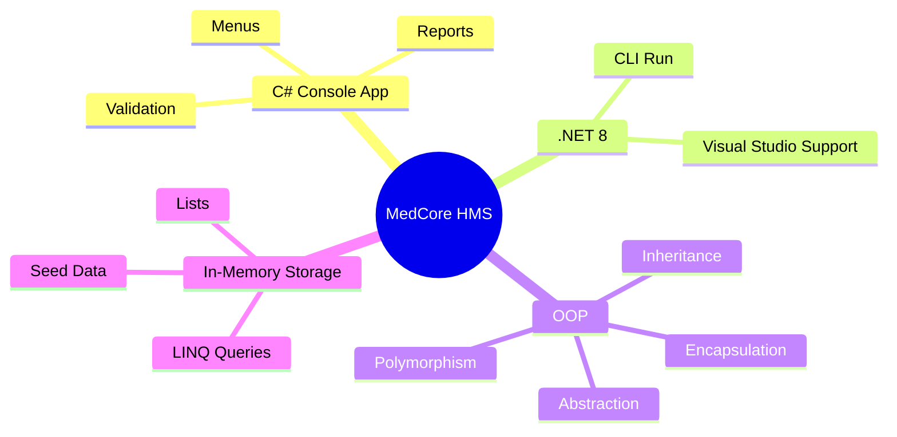

<div align="center">

  

  <p>
    <b>A clean, feature-rich hospital management system built with C# and object-oriented programming.</b>
  </p>

  <p>
    
    
    
    
  </p>

  <p>
    <a href="#-overview">Overview</a> •
    <a href="#-features">Features</a> •
    <a href="#-architecture">Architecture</a> •
    <a href="#-project-structure">Structure</a> •
    <a href="#-run-the-project">Run</a> •
    <a href="#-oop-concepts">OOP Concepts</a>
  </p>

</div>

---

## 🏥 Overview

**MedCore Hospital Management System** is a console-based hospital administration project designed to demonstrate strong **C# OOP architecture** through a realistic healthcare workflow.

When the application starts, it creates a `HospitalService`, loads demo data through `SeedData.Populate()`, and opens an interactive menu where the user acts like a hospital administrator.

The system can manage:

| Module | Purpose |
|---|---|
| Doctor Management | Register doctors, view reports, search, schedules, and remove doctors |
| Patient Management | Register patients, admit/discharge them, track critical status |
| Nurse Management | Add nurses, filter by shift, assign ward tasks |
| Appointment Management | Book appointments and control appointment status transitions |
| Department Management | Create departments, assign doctors, track occupancy |
| Medical Records | Add immutable patient records and view medical history |
| Statistics & Reports | Generate live hospital-wide reports using LINQ |

> Data is stored **in memory only**. It exists while the program is running and is cleared when the application closes. This is intentional for an OOP coursework/demo project.

---

## ✨ Features

<table>
  <tr>
    <td width="50%">
      <h3>👨‍⚕️ Doctors</h3>
      <ul>
        <li>Automatic ID generation starting from <code>1000</code></li>
        <li>Specialization, salary, service years, department</li>
        <li>Doctor schedule with availability checks</li>
        <li>Certifications and detailed reports</li>
      </ul>
    </td>
    <td width="50%">
      <h3>🧑‍🦽 Patients</h3>
      <ul>
        <li>Blood type, ward, allergies, insurance ID</li>
        <li>Outpatient, inpatient, discharged, critical states</li>
        <li>Admission and discharge business rules</li>
        <li>Chronological medical history</li>
      </ul>
    </td>
  </tr>
  <tr>
    <td width="50%">
      <h3>💉 Nurses</h3>
      <ul>
        <li>Morning, evening, and night shifts</li>
        <li>Ward assignment</li>
        <li>RN / BSN qualification tracking</li>
        <li>Task assignment and reporting</li>
      </ul>
    </td>
    <td width="50%">
      <h3>📅 Appointments</h3>
      <ul>
        <li>Doctor and patient validation</li>
        <li>No double-booking for doctors</li>
        <li>No duplicate same-day appointment for patients</li>
        <li>Strict appointment status state machine</li>
      </ul>
    </td>
  </tr>
</table>

---

## 🧠 System Flow



---

## 🧩 Architecture



---

## 🔄 Appointment State Machine



Status transitions are protected by business rules. For example, a completed appointment cannot be cancelled, and an appointment can only start after it has been confirmed.

---

## 📁 Project Structure

```text
HospitalApp/
├── Data/
│   └── SeedData.cs
├── Helpers/
│   └── ConsoleUI.cs
├── Interfaces/
│   ├── IReportable.cs
│   └── ISchedulable.cs
├── Models/
│   ├── Appointment.cs
│   ├── Department.cs
│   ├── Doctor.cs
│   ├── MedicalRecord.cs
│   ├── Nurse.cs
│   ├── Patient.cs
│   └── Person.cs
├── Services/
│   └── HospitalService.cs
├── Program.cs
├── HospitalApp.csproj
└── HospitalApp.sln
```

### Folder Responsibilities

| Folder | Responsibility |
|---|---|
| `Models` | Domain objects such as `Doctor`, `Patient`, `Appointment`, and `Department` |
| `Interfaces` | Shared contracts like reporting and scheduling |
| `Services` | Core business logic and in-memory collections |
| `Data` | Demo seed data loaded at startup |
| `Helpers` | Console UI, prompts, tables, colors, progress bars |
| Root files | App entry point and .NET project configuration |

---

## 📌 Important Files

<details>
<summary><b>Program.cs</b> — Application entry point and menus</summary>

`Program.cs` starts the application, creates the hospital service, loads seed data, and controls the main menu loop. It contains separate menu flows for doctors, patients, nurses, appointments, departments, medical records, and statistics.

</details>

<details>
<summary><b>HospitalService.cs</b> — Business logic layer</summary>

`HospitalService` is the central service of the project. It stores private in-memory lists for doctors, patients, nurses, appointments, and departments. It provides methods for adding, searching, filtering, removing, booking, assigning, and reporting.

</details>

<details>
<summary><b>Person.cs</b> — Abstract base class</summary>

`Person` contains shared properties such as `Id`, `FullName`, `Age`, `Phone`, `Email`, and `RegisteredAt`. It is inherited by `Doctor`, `Patient`, and `Nurse`, which keeps common logic in one place.

</details>

<details>
<summary><b>Appointment.cs</b> — Status rules and scheduling</summary>

`Appointment` connects a doctor and patient. It also controls the appointment lifecycle with methods like `Confirm()`, `Start()`, `Complete()`, `Cancel()`, and `MarkNoShow()`.

</details>

<details>
<summary><b>SeedData.cs</b> — Ready-to-use demo hospital</summary>

`SeedData` loads sample departments, doctors, nurses, patients, appointments, and medical records so the system is usable immediately after launch.

</details>

---

## 🚀 Run the Project

### Requirements

- [.NET 8 SDK](https://dotnet.microsoft.com/download/dotnet/8.0)
- Visual Studio, Visual Studio Code, or any terminal with .NET CLI

### Run with .NET CLI

```bash
dotnet restore
dotnet run
```

### Run with Visual Studio

1. Open `HospitalApp.sln`
2. Set `HospitalApp` as the startup project
3. Press `F5` or click **Run**

---

## 🖥️ Console Experience

```text
MAIN MENU
1. Doctor Management
2. Patient Management
3. Nurse Management
4. Appointment Management
5. Department Management
6. Medical Records
7. Statistics & Reports
0. Exit System
```

Example doctor report:

```text
DOCTOR REPORT
ID            : #1000
Name          : James Hartwell
Specialization: Cardiology
Salary        : $8,500.00
Appointments  : 2
Certifications: FACC, FESC
```

---

## 🧪 Validation & Business Rules

| Area | Rule |
|---|---|
| Doctor age | Must be between `18` and `80` |
| Patient age | Must be between `0` and `120` |
| Salary | Cannot be negative |
| Department name | Must be unique |
| Department capacity | Must be between `1` and `50` |
| Doctor booking | A doctor cannot have two appointments in the same hour |
| Patient booking | A patient cannot have more than one appointment on the same day |
| Discharge | Only admitted patients can be discharged |
| Records | Medical records are kept as patient history |

---

## 🧬 OOP Concepts

| Concept | Where It Appears | Why It Matters |
|---|---|---|
| Abstraction | `Person` abstract class | Defines shared human identity without allowing direct `Person` objects |
| Encapsulation | Private lists and `AsReadOnly()` | Protects collections from outside modification |
| Inheritance | `Doctor`, `Patient`, `Nurse` inherit `Person` | Reuses common code and keeps the model clean |
| Polymorphism | `GetInfo()` and `GenerateReport()` | Same method name, different behavior per class |
| Interfaces | `ISchedulable`, `IReportable` | Defines contracts for scheduling and reports |
| Enums | `PatientStatus`, `ShiftType`, `AppointmentStatus`, `RecordType` | Keeps domain states readable and safe |
| State Machine | Appointment lifecycle | Enforces realistic workflow transitions |
| LINQ | Filtering, ordering, grouping | Makes collection queries concise and expressive |
| Exception Handling | `try/catch` around operations | Prevents crashes and gives friendly error messages |

---

## 📊 Demo Data Loaded on Startup

| Data Type | Count |
|---|---:|
| Doctors | 6 |
| Nurses | 5 |
| Patients | 6 |
| Departments | 5 |
| Appointments | 5 |
| Medical Records | 5 |

The demo dataset includes cardiology, neurology, surgery, pediatrics, emergency care, admitted patients, critical patients, certifications, assigned nurse tasks, and confirmed appointments.

---

## 🛠️ Tech Stack



---

## 🌟 Why This Project Is Strong

- It uses real domain entities instead of simple demo classes.
- It separates responsibilities into folders and layers.
- It contains meaningful business rules.
- It demonstrates all major OOP principles clearly.
- It includes validation, reports, searching, filtering, and state transitions.
- It is easy to explain in a presentation or defend in an OOP exam.

---

<div align="center">

  

  <p><b>Built with C#, .NET 8, and clean object-oriented design.</b></p>

</div>
