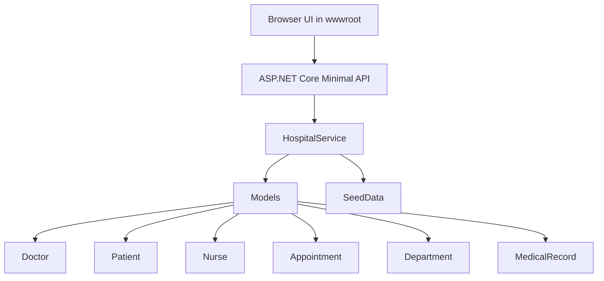
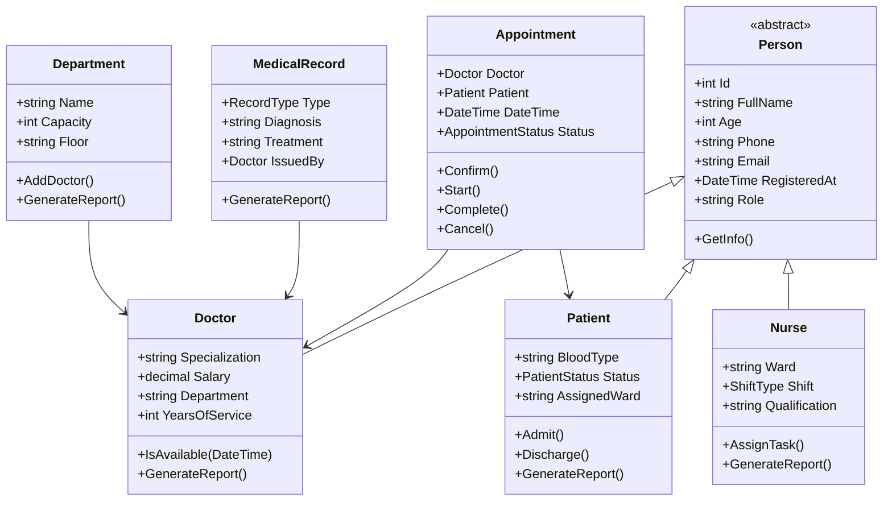

<div align="center">

# MedCore Hospital Management System

**A professional ASP.NET Core web dashboard for a C# OOP hospital management system.**


[Overview](#overview) | [Features](#features) | [What Changed](#what-changed) | [Project Structure](#project-structure) | [Run](#run-the-project) | [OOP Concepts](#oop-concepts)

</div>

---

## Overview

**MedCore** is a hospital management project built with **C#**, **.NET 8**, **ASP.NET Core**, and clean **object-oriented programming**.

The application provides a complete professional web UI for managing hospital operations while preserving a clean C# OOP domain model in the model and service layers.

The system manages:

| Module | Purpose |
|---|---|
| Dashboard | Live hospital overview, KPI cards, capacity panels, appointment summaries |
| Doctor Management | Register doctors, view doctor reports, inspect schedules, remove doctors |
| Patient Management | Register patients, admit/discharge patients, track critical cases |
| Nurse Management | Add nurses, view shift coverage, assign nurse tasks |
| Appointment Management | Book appointments and update appointment workflow status |
| Department Management | Create departments, assign doctors, track occupancy |
| Medical Records | Add patient records and review diagnosis/treatment history |
| Reports | Staff totals, inpatients, appointment state counts, department occupancy |

> Data is stored in memory for demo/coursework purposes. It resets when the application restarts.

---

## Features

### Professional Web Dashboard

- Responsive browser-based UI in `wwwroot`.
- Sidebar navigation for all hospital modules.
- KPI cards for doctors, nurses, patients, appointments, critical cases and records.
- Searchable tables for staff, patients, appointments and records.
- Detail drawer for doctor, patient, nurse, appointment and medical record reports.
- Modern visual design with cards, status badges, occupancy bars and responsive layouts.

### Doctors

- Automatic ID generation.
- Full name, age, phone, email, specialization, salary and years of service.
- Department assignment through department workflows.
- Schedule visibility through appointment bookings.
- Doctor report drawer in the UI.
- Remove doctor workflow that cancels future appointments when needed.

### Patients

- Patient registration with blood type, emergency contact, insurance and allergies.
- Patient states: `Outpatient`, `Inpatient`, `Discharged`, `Critical`.
- Admit and discharge actions from the UI.
- Critical patient tracking.
- Medical history connected to each patient.

### Nurses

- Nurse registration with ward, shift and qualification.
- Shift types: `Morning`, `Evening`, `Night`.
- Shift summary cards.
- Task assignment from the UI.
- Nurse detail reports.

### Appointments

- Appointment booking with doctor and patient validation.
- Doctor double-booking protection.
- Patient same-day duplicate appointment protection.
- Status workflow:
  - `Pending`
  - `Confirmed`
  - `InProgress`
  - `Completed`
  - `Cancelled`
  - `NoShow`
- Status updates from the dashboard.

### Departments

- Department creation with name, capacity, floor and phone extension.
- Doctor assignment to departments.
- Capacity limit enforcement.
- Occupancy bars and team cards.

### Medical Records

- Records are added to patient history.
- Record types include diagnosis, surgery, lab result, prescription, consultation and emergency.
- Each record stores diagnosis, treatment, medication, notes and issuing doctor.
- Records are shown in searchable tables and detail drawers.

---

## What Changed

This version upgrades the project into a full web application:

| Area | Change |
|---|---|
| Project type | ASP.NET Core web application using `Microsoft.NET.Sdk.Web` |
| Entry point | `Program.cs` configures routing, APIs, static files and seed data |
| UI | Added a complete responsive web dashboard under `wwwroot` |
| API | Added endpoints for overview, doctors, patients, nurses, appointments, departments and records |
| Reports | Added visual report cards and detail drawers |
| JSON | Added string enum support for cleaner API requests |
| README | Rewritten to describe the new web application accurately |

---

## Architecture





---

## API Endpoints

| Method | Endpoint | Purpose |
|---|---|---|
| `GET` | `/api/overview` | Dashboard counts, upcoming appointments, department summaries |
| `GET` | `/api/doctors` | List doctors |
| `POST` | `/api/doctors` | Add doctor |
| `DELETE` | `/api/doctors/{id}` | Remove doctor |
| `GET` | `/api/patients` | List patients |
| `POST` | `/api/patients` | Register patient |
| `POST` | `/api/patients/{id}/admit` | Admit patient |
| `POST` | `/api/patients/{id}/discharge` | Discharge patient |
| `GET` | `/api/nurses` | List nurses |
| `POST` | `/api/nurses` | Add nurse |
| `POST` | `/api/nurses/{id}/tasks` | Assign nurse task |
| `GET` | `/api/appointments` | List appointments |
| `POST` | `/api/appointments` | Book appointment |
| `POST` | `/api/appointments/{id}/status` | Update appointment status |
| `GET` | `/api/departments` | List departments |
| `POST` | `/api/departments` | Create department |
| `POST` | `/api/departments/assign-doctor` | Assign doctor to department |
| `POST` | `/api/records` | Add medical record |

---

## Project Structure

```text
HospitalApp/
|-- Data/
|   |-- SeedData.cs
|-- Interfaces/
|   |-- IReportable.cs
|   |-- ISchedulable.cs
|-- Models/
|   |-- Appointment.cs
|   |-- Department.cs
|   |-- Doctor.cs
|   |-- MedicalRecord.cs
|   |-- Nurse.cs
|   |-- Patient.cs
|   |-- Person.cs
|-- Properties/
|   |-- launchSettings.json
|-- Services/
|   |-- HospitalService.cs
|-- wwwroot/
|   |-- index.html
|   |-- styles.css
|   |-- app.js
|-- HospitalApp.csproj
|-- HospitalApp.sln
|-- Program.cs
|-- README.md
```

### Folder Responsibilities

| Folder | Responsibility |
|---|---|
| `Models` | Domain classes and business entities |
| `Interfaces` | Shared contracts for reporting and scheduling |
| `Services` | In-memory hospital business logic |
| `Data` | Demo seed data loaded at startup |
| `wwwroot` | Browser UI: HTML, CSS and JavaScript |
| `Properties` | Local launch profile |
| Root files | ASP.NET Core app entry point, project file, solution and documentation |

---

## Important Files

| File | Purpose |
|---|---|
| `Program.cs` | Configures ASP.NET Core, loads seed data, serves static files and maps API endpoints |
| `Services/HospitalService.cs` | Central business service for all hospital operations |
| `Data/SeedData.cs` | Creates demo departments, doctors, nurses, patients, appointments and records |
| `wwwroot/index.html` | Main dashboard layout |
| `wwwroot/styles.css` | Professional responsive UI design |
| `wwwroot/app.js` | Dashboard rendering, forms, API calls, search and detail drawers |
| `Models/*.cs` | OOP domain model |

---

## Run the Project

### Requirements

- .NET 8 SDK
- Visual Studio, Visual Studio Code, Rider, or .NET CLI

### Run with .NET CLI

```bash
dotnet restore
dotnet run --urls http://localhost:5000
```

Open the app:

```text
http://localhost:5000
```

### Run with Visual Studio

1. Open `HospitalApp.sln`.
2. Set `HospitalApp` as the startup project.
3. Run the project.
4. Open the displayed localhost URL in a browser.

---

## Validation & Business Rules

| Area | Rule |
|---|---|
| Person age | Must be valid for the domain model |
| Phone | Cannot be empty |
| Salary | Cannot be negative |
| Department name | Must be unique |
| Department capacity | Must be positive |
| Doctor appointment | A doctor cannot be booked twice in the same hour |
| Patient appointment | A patient cannot have more than one active appointment on the same day |
| Appointment state | Status transitions are controlled by methods like `Confirm`, `Start`, `Complete`, `Cancel` |
| Discharge | Only admitted patients can be discharged |
| Records | Medical records are stored as patient history |

---

## OOP Concepts

| Concept | Where It Appears | Why It Matters |
|---|---|---|
| Abstraction | `Person` abstract class | Shared identity for doctors, patients and nurses |
| Encapsulation | Private collections in `HospitalService` and model classes | Protects internal state |
| Inheritance | `Doctor`, `Patient`, `Nurse` inherit `Person` | Reuses common fields and behavior |
| Polymorphism | `GetInfo()` and `GenerateReport()` | Different report behavior per entity |
| Interfaces | `IReportable`, `ISchedulable` | Defines shared capabilities |
| Enums | Appointment, patient, nurse shift and record statuses | Keeps state safe and readable |
| LINQ | Filtering, grouping, searching and reporting | Clean data queries over in-memory collections |

---

## Demo Data

| Data Type | Count |
|---|---:|
| Doctors | 6 |
| Nurses | 5 |
| Patients | 6 |
| Departments | 5 |
| Appointments | 5 |
| Medical Records | 5 |

Demo data includes cardiology, neurology, surgery, pediatrics, emergency care, admitted patients, critical patients, certifications, nurse tasks and confirmed appointments.

---

## Tech Stack

| Layer | Technology |
|---|---|
| Backend | C#, .NET 8, ASP.NET Core Minimal API |
| Frontend | HTML, CSS, JavaScript |
| Architecture | OOP domain model + service layer |
| Data | In-memory collections with seed data |
| Styling | Responsive custom CSS dashboard |

---

## Why This Project Is Strong

- It keeps a clear C# OOP domain model.
- It upgrades the user experience into a real web dashboard.
- It has meaningful hospital workflows and validation rules.
- It demonstrates inheritance, encapsulation, interfaces, enums, state machines and LINQ.
- It is easy to present because the UI now shows every major module visually.

---

<div align="center">

**MedCore HMS - C# OOP hospital management with a professional ASP.NET Core web dashboard.**

</div>

